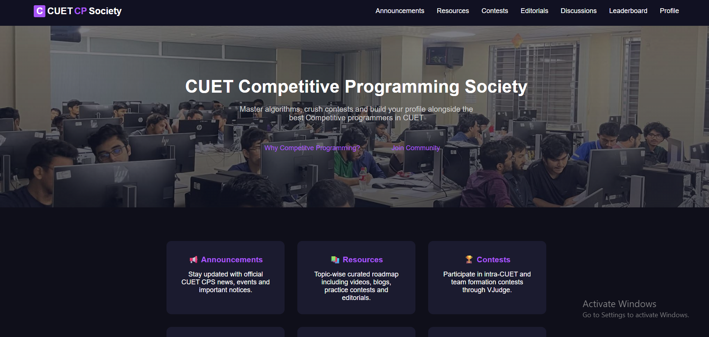

# CUET Competitive Programming Society

This project was built as part of Internet Programming Sessional (CSE-326). It is meant to organize all activities of CUET Competitive Programming Society and bring every CP enthusiast of CUET under one umbrella.



## Purpose

- Centralize announcements, contests, editorials, discussions, resources and leaderboard.
- Provide a single platform for members to learn, compete and collaborate.
- Showcase society activities and keep the community connected.

## Tech Stack

- Frontend: HTML, CSS, JavaScript
- Backend: Node.js, Express
- Database: MongoDB with Mongoose

## Project Structure

- frontend/ contains static pages, styles and scripts
- backend/ contains the API server, routes, models and middleware

## Setup and Run

1. Clone the repository

```
git clone <your-repo-url>
cd cuet-cp-society
```

2. Install backend dependencies

```
cd backend
npm install
```

3. Create a .env file in backend/ with your MongoDB connection string

```
MONGO_URI_PROD=your_mongodb_connection_string
PORT=5000
```

4. Start the backend server

```
npm start
```

5. Open the frontend

- Open frontend/index.html in a browser or use a simple static server

## Acknowledgement

This project was supervised by Md. Rashadur Rahman, Assistant Professor, Dept of CSE, CUET.
